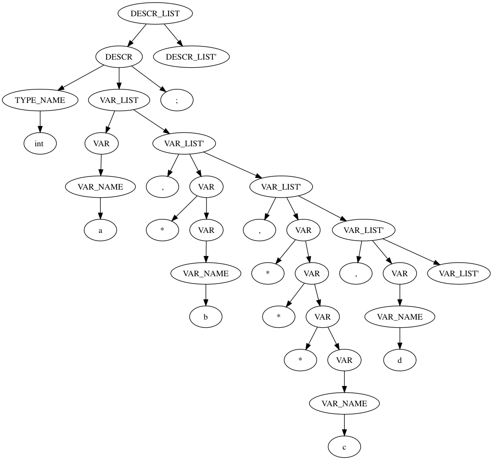

# Вариант 6. Описание переменных в Си

Описания переменных в Си. Сначала следует имя типа, затем разделенные запятой имена переменных. Переменная может быть указателем, в этом случае перед ней идет звездочка (возможны и указатели на указатели, и т. д.). Описаний может быть несколько. 
Используйте один терминал для всех имен переменных и имен типов. 
Пример: int a, *b, ***c, d; 

*Moдификация: поддержка описания одномерных массивов.*

## Грамматика
*`DESCR_LIST`* -> *`DESCR DESCR_LIST'`* 
*`DESCR_LIST'`* -> *`DESCR DESCR_LIST'`* | *`eps`*  
*`DESCR`* -> *`TYPE_NAME VAR_LIST;`* 
*`TYPE_NAME`* ->*`word`* 
*`VAR_LIST`* -> *`VAR VAR_LIST'`* 
*`VAR_LIST'`* -> *`,VAR VAR_LIST'`* | *`eps`*  
*`VAR`* -> *`*VAR`* | *`VAR_NAME ARRAY`* 
*`VAR_NAME`* ->*`word`* 
*`ARRAY`* ->*`size`* | *`eps`*  

*(word -  это \[A-Za-z\](\[A-Za-z\])\*)*  
*(size -  это [ \[0-9\](\[0-9\])\*)* ]

Нетерминал | Описание | FIRST | FOLLOW
-|-|-|-
DESCR_LIST | Список строк описаний | `word` | `$`
DESCR_LIST' | Продолжение списка строк описаний | `word`, `eps` | `$`
DESCR | Строка описаний | `word` | `word`, `$`
TYPE_NAME | Имя типа | `word` | `*`, `word`
VAR_LIST | Список переменных | `*`, `word` | `;`
VAR_LIST' | Продолжение списка переменных |  `,`, `eps`  | `;`
VAR | Переменная  |  `*`, `word` | `,`,`;`
VAR_NAME | Имя переменной |  `word` | `size`,`,`,`;`
ARRAY | Часть описания массива |  `size` ,`eps` | `,`,`;`

## Пример
Дерево разбора для: *int a, \*b, \*\*\*c, d;* 

